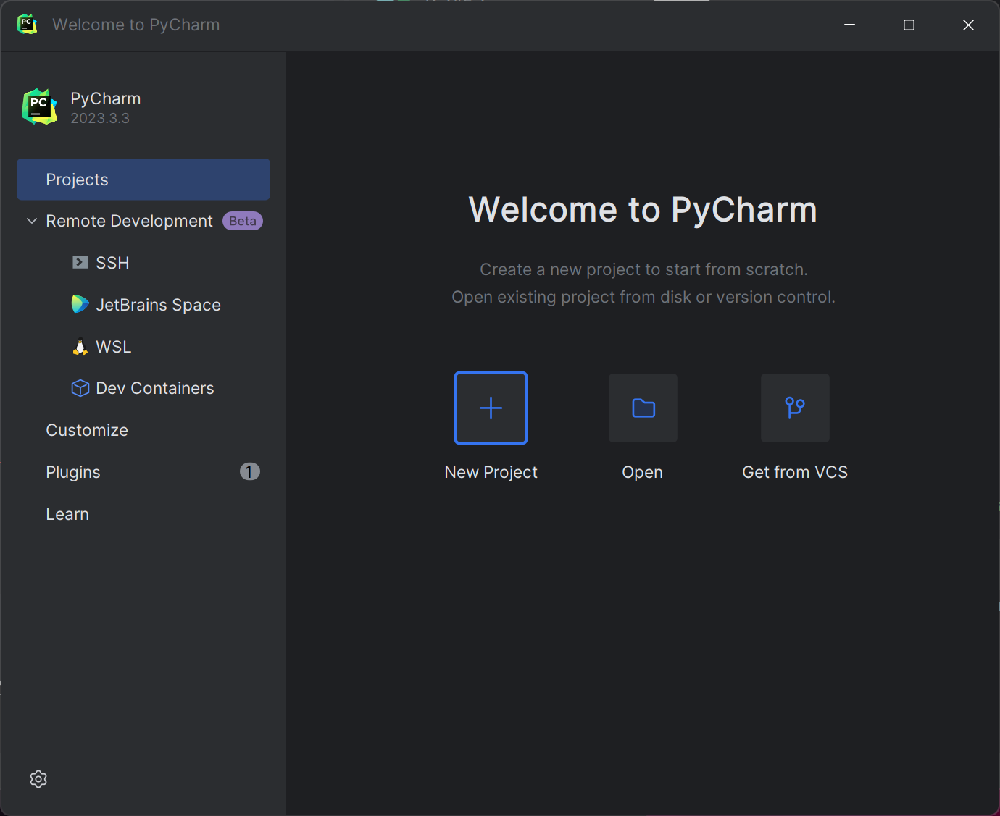
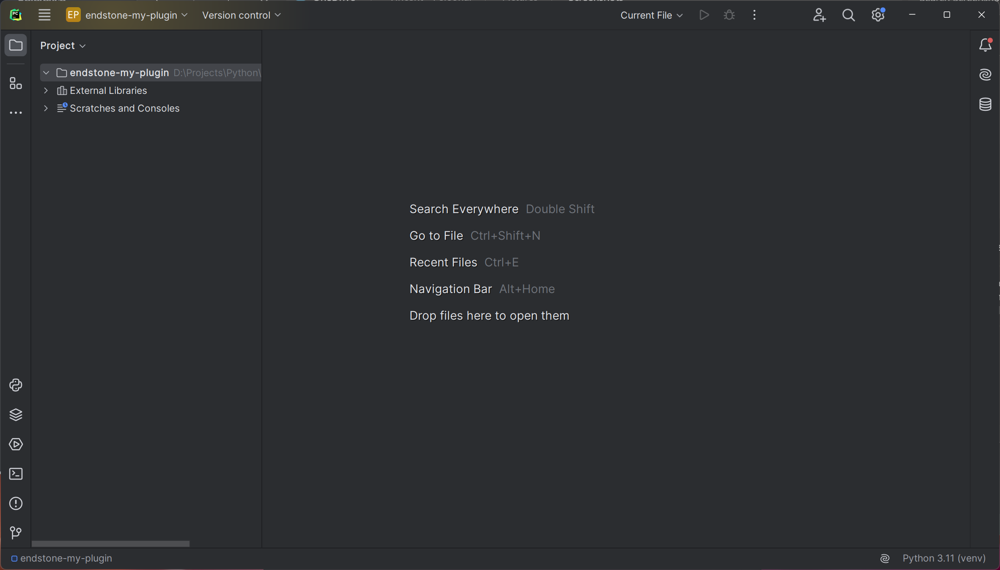
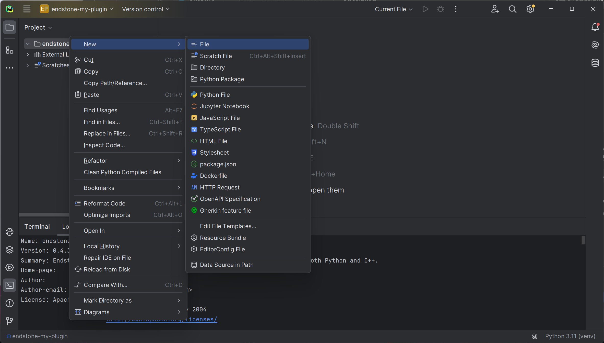

# Create your first plugin

## Create a new project

=== ":fontawesome-brands-python: Python"
    
    ### Prerequisites

    To develop your first plugin with the Python API, you will have to install the following prerequisites:
    
    -   [Jetbrains PyCharm]
    -   [Python] (>= 3.9)
    -   [endstone Python package]

    ### Creating a PyCharm project

    When you start up PyCharm, you will see this welcome screen:
    

    Click on **New Project**

    

    Let's say you want to name your plugin **MyPlugin**. In Endstone plugin development, we follow the following 
    naming convention:

    1. Use `lower-case-with-dash` for project name
    2. Prefix your project name with `endstone-`

    Hence, you should put `endstone-my-plugin` in the **Name** field.

    Then, in the **Interpreter type**, select *Custom environment*. Select **Select existing**, and set the path to 
    where you previously installed `endstone` as stated in the prerequisites.

    Finally, click on **Create**. The PyCharm workspace will pop up and you will see this.
    

    !!! tip
        Endstone server requires its plugins to be installed in the same Python environment. A virtual environment is
        **strongly recommanded**.

    ### Check your dependencies

    In the last step, you selected the existing interpreter where `endstone` package is installed. For now, that's the
    only dependency we need for a simple plugin. To check its installation, click on the :octicons-terminal-16: icon on
    the side bar to open the terminal and type:
    ```
    pip show endstone
    ```

    You show see something like this:
    ```
    Name: endstone
    Version: 0.4.2
    Summary: Endstone offers a plugin API for Bedrock Dedicated Servers, supporting both Python and C++.
    Home-page:
    Author:
    Author-email: Vincent Wu <magicdroidx@gmail.com>
    License: Apache License
    ```

    ### Create `pyproject.toml`

    Modern Python packages can contain a `pyproject.toml` file, first introduced in [PEP 518]. This file contains build 
    system requirements and information, which are used by pip to build the package.
    
    Now, right click on the project folder and select **New > File** to create a `pyproject.toml`. 
        

    Copy the following content and paste into the file.
    ``` toml title="pyproject.toml" linenums="1"
    [build-system]
    requires = ["setuptools >= 61.0"]
    build-backend = "setuptools.build_meta"
    
    [project]
    name = "endstone-my-plugin"
    version = "0.1.0"
    ```

    !!! notice
        The name field should always be the project name. It must start with `endstone-` which is **enforced** by the 
        plugin loader. The name should also use `lower-case-with-dash` style.

    [Jetbrains PyCharm]: https://www.jetbrains.com/pycharm/
    [Python]: https://www.python.org/downloads/
    [endstone Python package]: ../getting-started/installation.md#with-pip
    [PEP 518]: https://peps.python.org/pep-0518/
    

=== ":simple-cplusplus: C++"

    ### Create `CMakeLists.txt`

    ``` CMake title="CMakeLists.txt" linenums="1"
    cmake_minimum_required(VERSION 3.15)
    
    project(endstone_example_plugin CXX)
    
    set(CMAKE_CXX_STANDARD 17)
    set(CMAKE_CXX_STANDARD_REQUIRED ON)
    
    include(FetchContent)
    FetchContent_Declare(
        endstone
        GIT_REPOSITORY https://github.com/EndstoneMC/endstone.git
        GIT_TAG main #(1)!
    )
    FetchContent_MakeAvailable(endstone)

    if (CMAKE_CXX_COMPILER_ID STREQUAL "MSVC") #(2)!
        add_compile_definitions(_ITERATOR_DEBUG_LEVEL=0)
    elseif (CMAKE_CXX_COMPILER_ID STREQUAL "Clang")
        set(CMAKE_CXX_FLAGS "${CMAKE_CXX_FLAGS} -stdlib=libc++ -fPIC")
        link_libraries(-static-libgcc -static-libstdc++ libc++.a libc++abi.a)
    endif ()
    ```

    1.  :warning: This will use the latest development version of Endstone. Consider use a release tag (e.g. `v0.4.0`) instead of `main`.
    2.  :information_source: The following lines are necessary for ensuring ABI compatibility with the Bedrock Dedicated Server (BDS).

## Create the main plugin class

=== "Python"

    ``` python title="src/endstone_example/example_plugin.py" linenums="1" 
    from endstone.plugin import Plugin

    class ExamplePlugin(Plugin):
        pass
    ```

    ``` python title="src/endstone_example/__init__.py" linenums="1"
    from endstone_example.example_plugin import ExamplePlugin

    __all__ = ["ExamplePlugin"]
    ```

=== "C++"

    ``` c++ title="include/example_plugin.h" linenums="1" 
    #include "endstone/plugin/plugin.h"

    class ExamplePlugin : public endstone::Plugin {}
    ```

    ``` c++ title="src/example_plugin.cpp" linenums="1"
    #include "example_plugin.h"
    ```

    ``` CMake title="CMakeLists.txt" linenums="1" hl_lines="23-25"
    cmake_minimum_required(VERSION 3.15)
    
    project(endstone_example_plugin CXX)
    
    set(CMAKE_CXX_STANDARD 17)
    set(CMAKE_CXX_STANDARD_REQUIRED ON)
    
    include(FetchContent)
    FetchContent_Declare(
        endstone
        GIT_REPOSITORY https://github.com/EndstoneMC/endstone.git
        GIT_TAG main
    )
    FetchContent_MakeAvailable(endstone)

    if (CMAKE_CXX_COMPILER_ID STREQUAL "MSVC")
        add_compile_definitions(_ITERATOR_DEBUG_LEVEL=0)
    elseif (CMAKE_CXX_COMPILER_ID STREQUAL "Clang")
        set(CMAKE_CXX_FLAGS "${CMAKE_CXX_FLAGS} -stdlib=libc++ -fPIC")
        link_libraries(-static-libgcc -static-libstdc++ libc++.a libc++abi.a)
    endif ()

    add_library(${PROJECT_NAME} SHARED src/example_plugin.cpp)
    target_include_directories(${PROJECT_NAME} PUBLIC include)
    target_link_libraries(${PROJECT_NAME} PRIVATE endstone::headers)
    ```

## Add methods

=== "Python"

    ``` python title="src/endstone_example/example_plugin.py" linenums="1" hl_lines="4-5 7-8 10-11"
    from endstone.plugin import Plugin

    class ExamplePlugin(Plugin):
        def on_load(self) -> None:
            self.logger.info("on_load is called!")

        def on_enable(self) -> None:
            self.logger.info("on_enable is called!")

        def on_disable(self) -> None:
            self.logger.info("on_disable is called!")
    ```

=== "C++"

    ``` c++ title="include/example_plugin.h" linenums="1" hl_lines="4-8 10-13 15-18"
    #include "endstone/plugin/plugin.h"

    class ExamplePlugin : public endstone::Plugin {
    public:
        void onLoad() override
        {
            getLogger().info("onLoad is called");
        }
    
        void onEnable() override
        {
            getLogger().info("onEnable is called");
        }
    
        void onDisable() override
        {
            getLogger().info("onDisable is called");
        }
    }
    ```

## Configure plugin metadata

=== "Python"

    ``` python title="src/endstone_example/example_plugin.py" linenums="1" hl_lines="4-7"
    from endstone.plugin import Plugin

    class ExamplePlugin(Plugin):
        name = "PythonExamplePlugin"
        version = "0.4.0"
        api_version = "0.4"
        description = "Python example plugin for Endstone servers"

        def on_load(self) -> None:
            self.logger.info("on_load is called!")

        def on_enable(self) -> None:
            self.logger.info("on_enable is called!")

        def on_disable(self) -> None:
            self.logger.info("on_disable is called!")
    ```

    ``` toml title="pyproject.toml" linenums="1" hl_lines="9-10"
    [build-system]
    requires = ["setuptools >= 61.0"]
    build-backend = "setuptools.build_meta"
    
    [project]
    name = "endstone-example"
    version = "0.4.0"

    [project.entry-points."endstone"]
    example = "endstone_example:ExamplePlugin"
    ```

=== "C++"

    ``` c++ title="src/example_plugin.cpp" linenums="1" hl_lines="3-6"
    #include "example_plugin.h"

    ENDSTONE_PLUGIN(/*(1)!*/"CppExamplePlugin", /*(2)!*/"0.4.0", /*(3)!*/ExamplePlugin)
    {
        description = "C++ example plugin for Endstone servers";
    }
    ```

    1.  :abc: This is the plugin name!
    2.  :hash: This is the plugin version!
    3.  :white_check_mark: This is the main class of the plugin!

